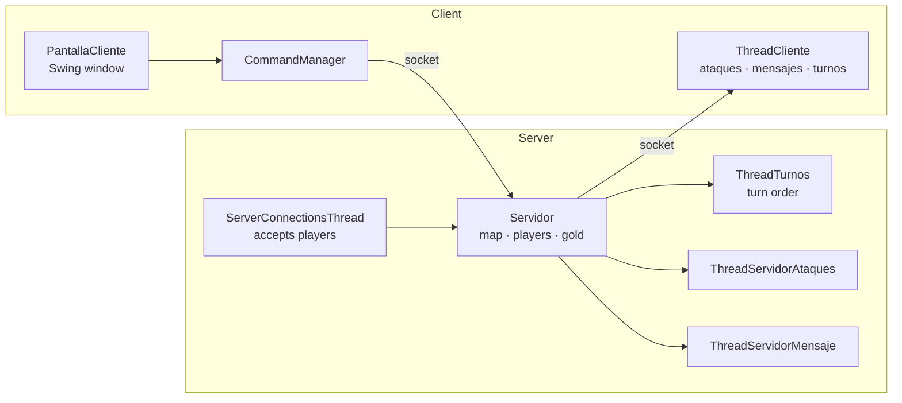

# Pirate Treasure Hunt

A turn-based multiplayer pirate game written entirely in **Java**, with a Swing interface. Players connect to a shared server, sail their ships across the map, scan for enemies with radars, launch attacks, plant mines, buy items and chat with each other. The pirate with the most gold wins, or the last one left standing.

Built as an **Object-Oriented Programming** course project at the Instituto Tecnológico de Costa Rica (TEC).


---

## Features

- **Client-server multiplayer:** one server hosts the game and several players connect to it over the network with sockets.
- **Turn system:** the server manages whose turn it is and keeps every client in sync.
- **Concurrent threads:** separate threads handle connections, turns, attacks and messages on both the server and the client, so the game never blocks while waiting for a player.
- **Map with ships and threats:** a grid of cells where each pirate controls a ship, with different cell types and hidden dangers.
- **Attacks and mines:** heavy and long-range attacks, plus mines that can be planted on the map.
- **Radars:** short-range and long-range radars to discover what is around you.
- **Shop:** spend gold on items.
- **Group and private chat** between players.
- **Text commands:** every action is typed as a command and handled with the Command pattern.
- **Design patterns:** Factory, Prototype, Singleton and Command.

## How to win

- **Richest pirate:** collect as much gold as you can. The pirate with the most gold at the end wins.
- **Last one standing:** if every other pirate is defeated, the last one alive wins.

## How it works



1. The server starts from its window and waits for players.
2. Each player opens the client, enters their details and connects to the server through a **socket**.
3. The server keeps the shared state (map, ships, gold) and uses dedicated threads for **turns**, **attacks** and **chat messages**.
4. On their turn, a player types a command. The client turns that text into a command object and sends it to the server.
5. The server applies the result and notifies the affected players, whose client threads update their screens.

## Commands

<!-- Replace the left column with the exact text players type in your game. -->

| Command | Class | What it does |
|---|---|---|
| Move | `Mover` | Moves your ship on the map |
| Move & discover | `MoverDescubrirCommand` | Moves and reveals the cells around you |
| Heavy attack | `AtaqueHeavyCommand` | Launches a powerful attack |
| Long attack | `AtaqueLongCommand` | Attacks from a distance |
| Mine | `MinaCommand` | Plants a mine on the map |
| Short radar | `RadarShortCommand` | Scans the nearby area |
| Long radar | `RadarLongCommand` | Scans a wider area |
| Spot | `SpotCommand` | Marks a spot on the map |
| Buy | `ComprarCommand` | Buys an item with your gold |
| Exit | `ExitCommand` | Leaves the game |

Unknown or badly written commands are handled by `NotFoundCommand` and `ErrorCommand`, so the game shows a clear message instead of crashing.

## Design patterns

<!-- Check that each line matches exactly how you used the pattern. -->

| Pattern | Where it's used |
|---|---|
| **Command** | Each player action is a class that implements `ICommand` (through `BaseCommand`), in the `Commands` package. Adding a new action means adding a new class. |
| **Factory** | `CommandManager` creates the right command object from the text the player types, and falls back to `NotFoundCommand` when it doesn't recognize it. |
| **Prototype** | Clones preconfigured objects (such as attacks or cells) to create new ones instead of building them from scratch. |
| **Singleton** | Guarantees a single shared instance of a core object, such as the command manager or the server. |

## Project structure

```
src/main/java/
├── Servidor/                       # server window, connections, turns, attack and chat threads
├── Clientes/                       # client windows and the client's listener threads
├── Commands/                       # one class per command + CommandManager (Command & Factory)
├── Ataques/                        # IAtaques, heavy and long attacks, mines
├── Radares/                        # radars and spots
├── Modelos/                        # Mensaje (chat messages)
├── Imagenes/                       # game images
└── com/mycompany/proyecto2/
    ├── Proyecto2.java
    └── Mapa/                       # map, cells, cell types, ships, threats
```

## Getting started

### Requirements

- Java (JDK 17 or newer) <!-- change to the version you used -->
- Apache NetBeans (recommended) or any IDE that supports Maven

### Run it

1. Clone the repository and open the folder in **NetBeans** (*File → Open Project*).
2. Run **`Servidor/PantallaServidorInicializador.java`** to start the server (right-click → *Run File*).
3. Run **`Clientes/PantallaInicioClientes.java`** once per player to open a client and join the game.

To play from different computers, start the server on one machine and connect the clients to that machine's IP address.

## Tech

- Java · Swing
- Sockets (`java.net`)
- Threads and concurrency
- Maven
- Object-Oriented Programming and design patterns

## Author

**Tamara Villarevia Navarro** · Computer Engineering student at TEC
[GitHub](https://github.com/B1bisauri0)
